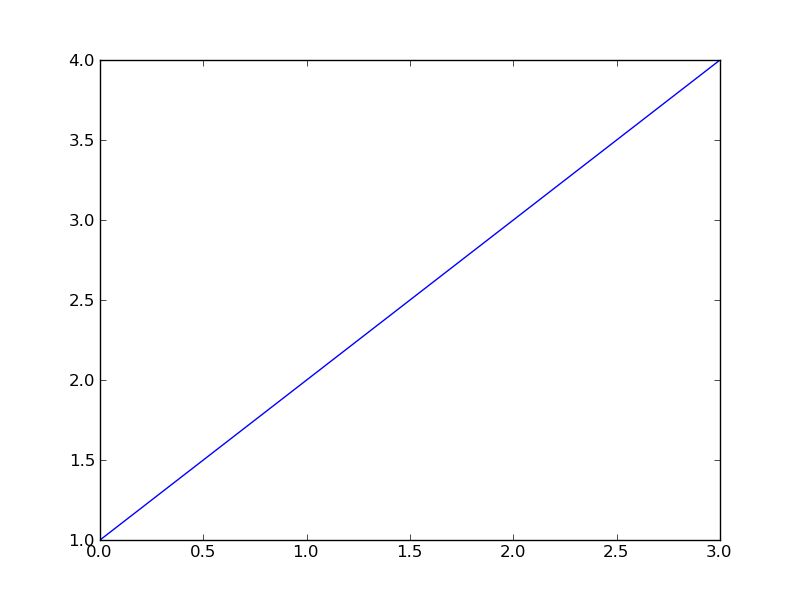

:author: Shannon Quinn
:email: spq@uga.edu
:institution: School of Computer Science, University of Georgia
:institution: Department of Cellular Biology, University of Georgia
:orcid: 0000-0002-8916-6335
:corresponding:

:author: Meekail Zain
:email: Meekail.Zain@uga.edu
:institution: School of Computer Science, University of Georgia
:equal-contributor:

:bibliography: mybib

:video: https://www.youtube.com/watch?v=HHFuTpVvRCI

------------------------------------------------
Self-Supervised Cilia Segmentation
------------------------------------------------

.. class:: abstract

   Automated segmentation of cilia from high-speed digital videos is bloody hard.
   The easiest situation entails a fixed camera recording live cilia in a profile 
   view (i.e., beating within the plane of the field of view) unobstructed by 
   floating debris or other cells, beating with rhythmic motions consisting of 
   forward power and backward recovery strokes. Even under these ideal conditions,
   other confounders in the field of view can mimic signals that traditional 
   object segmentation strategies look for. More often than not, these data are
   less than ideal, depicting immotile cilia, occluding cells, or a shaky camera. 
   Our own lab has, over the past decade, explored multiple image segmentation 
   stratgies for identifying respiratory cilia, with mixed results. Here, we
   ask the question: what if we trained an object segmentation model on the
   idealized data? Would that, against all intuition, improve the model's overall
   performance to specifically exclude the messier data from the training process?

.. class:: keywords

   image processing, respiratory cilia, segmentation, classification

Introduction
------------

Twelve hundred years ago  |---| in a galaxy just across the hill...

Lorem ipsum dolor sit amet, consectetur adipiscing elit. Vestibulum sapien
tortor, bibendum et pretium molestie, dapibus ac ante. Nam odio orci, interdum
sit amet placerat non, molestie sed dui. Pellentesque eu quam ac mauris
tristique sodales. Fusce sodales laoreet nulla, id pellentesque risus convallis
eget. Nam id ante gravida justo eleifend semper vel ut nisi. Phasellus
adipiscing risus quis dui facilisis fermentum. Duis quis sodales neque. Aliquam
ut tellus dolor. Etiam ac elit nec risus lobortis tempus id nec erat. Morbi eu
purus enim. Integer et velit vitae arcu interdum aliquet at eget purus. Integer
quis nisi neque. Morbi ac odio et leo dignissim sodales. Pellentesque nec nibh
nulla. Donec faucibus purus leo. Nullam vel lorem eget enim blandit ultrices.
Ut urna lacus, scelerisque nec pellentesque quis, laoreet eu magna. Quisque ac
justo vitae odio tincidunt tempus at vitae tortor.

Background
----------

There have been a few published attempts at solving the problem of automated
segmentation of respiratory cilia. Most of these attempts have come from our 
lab, dating back nearly a decade.

The earliest attempts used rule-based thresholds :cite:`quinn2014distributed,quinn2015automated`.
These thresholds were applied to the time-series grayscale pixel values, sometimes
as simple as computing the standard deviation of the grayscale pixel variation,
multiplying this value by a constant, and thresholding out any pixels whose 
standard deviation fell below this threshold. While performant and with
a surprisingly high true positive rate, this method would lead to patchy segments
many false positives. Post-processing to smooth the selected regions and 
remove spurious ones would improve the false positive rates, and combining this
procedure with a texture filter would also improve results :cite:`quinn2014distributed`.
However, thresholds based on pixel variations over time could not detect immotile
cilia, and texture filter augmentations false positive rates that were far too 
high to be useful without accompanying temporal pixel variations.

Deep learning provided an attractive alternative, and an early paper demonstrated
the viability of the method :cite:`lu2017classification`, albeit with constraints
that precluded any real-world applicability. Improvements in deep representation
methods led to architectures that could extract useful features for segmentation
:cite:`zain2020towards,zain2022low`, though these approaches suffered from a lack
of sufficient ground-truth data. As with most supervised problems in deep learning,
a substantial amount of labeled data is required; in this case, annotating video
data by hand is not only tedious and error-prone, but this particular data benefits
from expert assessment and is not readily amenable to being "farmed out" to 
anyone. In this case, the availability of high-quality ground-truth data proved
to be the bottleneck.

Alternative approaches that relied less on ground-truth data led to representing
images as multidimensional Fourier series :cite:`xu2019cilia`. Unfortunately, 
this approach only worked in tightly-focused images; most images of cilia capture
multiple cells, each with multiple ciliated edges. With so many different spatial
frequencies present, this strategy ultimately reverted to a form of thresholding.

Other attempts at automated cilia segmentation have been similarly stymied, or
operate in a domain that is distinct enough to be of little utility in our case.
For instance, approaches that operate only on ultrasound :cite:`minhaz2022deep`
or optical coherence tomography :cite:`cabeza2022automated`, while sometimes
useful at a conceptual level, do not work in our domain of high-speed digital 
differential interference contrast (DIC) video. CiliaQ :cite:`hansen2021ciliaq` 
is a very exciting open source plugin for ImageJ that can not only segment 
cilia but also compute many useful physiological features such as length and 
"bendiness"; however, it can only be used in a fluorescence microscopy setting.
Finally, there has been some other work on high-speed digital DIC video analysis
:cite:`puybareau2016automating` but it is almost universally unreproducible,
often lacking any accessible data, implementations, or often both.

By far, the biggest impediment to an automated method for cilia segmentation appears
to be data related: there is a dearth of high-quality, openly available, and
fully-annotated data for training and validating segmentation models. While we
are working on the problem of data availability, that is not what we are going to
address in this (single) paper. Instead, we propose a half-step: a way of leveraging
the data that is available to automatically build enough masks that are good enough
for the purposes of training a semantic segmentation model, specifically for 
high-speed digital DIC video of respiratory cilia.

Bibliographies, citations and block quotes
------------------------------------------

If you want to include a ``.bib`` file, do so above by placing  :code:`:bibliography: yourFilenameWithoutExtension` as above (replacing ``mybib``) for a file named :code:`yourFilenameWithoutExtension.bib` after removing the ``.bib`` extension.

**Do not include any special characters that need to be escaped or any spaces in the bib-file's name**. Doing so makes bibTeX cranky, & the rst to LaTeX+bibTeX transform won't work.

To reference citations contained in that bibliography use the :code:`:cite:`citation-key`` role, as in :cite:`hume48` (which literally is :code:`:cite:`hume48`` in accordance with the ``hume48`` cite-key in the associated ``mybib.bib`` file).

However, if you use a bibtex file, this will overwrite any manually written references.

So what would previously have registered as a in text reference ``[Atr03]_`` for

::

     [Atr03] P. Atreides. *How to catch a sandworm*,
           Transactions on Terraforming, 21(3):261-300, August 2003.

what you actually see will be an empty reference rendered as **[?]**.

E.g., :cite:`Atr03`.

If you wish to have a block quote, you can just indent the text, as in

    When it is asked, What is the nature of all our reasonings concerning matter of fact? the proper answer seems to be, that they are founded on the relation of cause and effect. When again it is asked, What is the foundation of all our reasonings and conclusions concerning that relation? it may be replied in one word, experience. But if we still carry on our sifting humor, and ask, What is the foundation of all conclusions from experience? this implies a new question, which may be of more difficult solution and explication. :cite:`hume48`

Dois in bibliographies
++++++++++++++++++++++

In order to include a doi in your bibliography, add the doi to your bibliography
entry as a string. For example:

.. code-block:: bibtex

   @Book{hume48,
     author =  "David Hume",
     year =    "1748",
     title =   "An enquiry concerning human understanding",
     address =     "Indianapolis, IN",
     publisher =   "Hackett",
     doi = "10.1017/CBO9780511808432",
   }

If there are errors when adding it due to non-alphanumeric characters, see if
wrapping the doi in ``\detokenize`` works to solve the issue.

.. code-block:: bibtex

   @Book{hume48,
     author =  "David Hume",
     year =    "1748",
     title =   "An enquiry concerning human understanding",
     address =     "Indianapolis, IN",
     publisher =   "Hackett",
     doi = \detokenize{10.1017/CBO9780511808432},
   }

Source code examples
--------------------

Of course, no paper would be complete without some source code.  Without
highlighting, it would look like this::

   def sum(a, b):
       """Sum two numbers."""

       return a + b

With code-highlighting:

.. code-block:: python

   def sum(a, b):
       """Sum two numbers."""

       return a + b

Maybe also in another language, and with line numbers:

.. code-block:: c
   :linenos:

   int main() {
       for (int i = 0; i < 10; i++) {
           /* do something */
       }
       return 0;
   }

Or a snippet from the above code, starting at the correct line number:

.. code-block:: c
   :linenos:
   :linenostart: 2

   for (int i = 0; i < 10; i++) {
       /* do something */
   }

Important Part
--------------

It is well known :cite:`Atr03` that Spice grows on the planet Dune.  Test
some maths, for example :math:`e^{\pi i} + 3 \delta`.  Or maybe an
equation on a separate line:

.. math::

   g(x) = \int_0^\infty f(x) dx

or on multiple, aligned lines:

.. math::
   :type: eqnarray

   g(x) &=& \int_0^\infty f(x) dx \\
        &=& \ldots

The area of a circle and volume of a sphere are given as

.. math::
   :label: circarea

   A(r) = \pi r^2.

.. math::
   :label: spherevol

   V(r) = \frac{4}{3} \pi r^3

We can then refer back to Equation (:ref:`circarea`) or
(:ref:`spherevol`) later.

Mauris purus enim, volutpat non dapibus et, gravida sit amet sapien. In at
consectetur lacus. Praesent orci nulla, blandit eu egestas nec, facilisis vel
lacus. Fusce non ante vitae justo faucibus facilisis. Nam venenatis lacinia
turpis. Donec eu ultrices mauris. Ut pulvinar viverra rhoncus. Vivamus
adipiscing faucibus ligula, in porta orci vehicula in. Suspendisse quis augue
arcu, sit amet accumsan diam. Vestibulum lacinia luctus dui. Aliquam odio arcu,
faucibus non laoreet ac, condimentum eu quam. Quisque et nunc non diam
consequat iaculis ut quis leo. Integer suscipit accumsan ligula. Sed nec eros a
orci aliquam dictum sed ac felis. Suspendisse sit amet dui ut ligula iaculis
sollicitudin vel id velit. Pellentesque hendrerit sapien ac ante facilisis
lacinia. Nunc sit amet sem sem. In tellus metus, elementum vitae tincidunt ac,
volutpat sit amet mauris. Maecenas [#]_ diam turpis, placerat [#]_ at adipiscing ac,
pulvinar id metus.

.. [#] On the one hand, a footnote.
.. [#] On the other hand, another footnote.

   This is the caption. :label:`egfig`

   This is a wide figure, specified by adding "w" to the figclass.  It is also
   center aligned, by setting the align keyword (can be left, right or center).

   This is the caption on a smaller figure that will be placed by default at the
   bottom of the page, and failing that it will be placed inline or at the top.
   Note that for now, scale is relative to a completely arbitrary original
   reference size which might be the original size of your image - you probably
   have to play with it. :label:`egfig2`

As you can see in Figures :ref:`egfig` and :ref:`egfig2`, this is how you reference auto-numbered
figures.

.. table:: This is the caption for the materials table. :label:`mtable`

   +------------+----------------+
   | Material   | Units          |
   +============+================+
   | Stone      | 3              |
   +------------+----------------+
   | Water      | 12             |
   +------------+----------------+
   | Cement     | :math:`\alpha` |
   +------------+----------------+

We show the different quantities of materials required in Table
:ref:`mtable`.

.. The statement below shows how to adjust the width of a table.

.. raw:: latex

   \setlength{\tablewidth}{0.8\linewidth}

.. table:: This is the caption for the wide table.
   :class: w

   +--------+----+------+------+------+------+--------+
   | This   | is |  a   | very | very | wide | table  |
   +--------+----+------+------+------+------+--------+

Unfortunately, restructuredtext can be picky about tables, so if it simply
won't work try raw LaTeX:

.. raw:: latex

   \begin{table*}

     \begin{longtable*}{|l|r|r|r|}
     \hline
     \multirow{2}{*}{Projection} & \multicolumn{3}{c|}{Area in square miles}\tabularnewline
     \cline{2-4}
      & Large Horizontal Area & Large Vertical Area & Smaller Square Area\tabularnewline
     \hline
     Albers Equal Area  & 7,498.7 & 10,847.3 & 35.8\tabularnewline
     \hline
     Web Mercator & 13,410.0 & 18,271.4 & 63.0\tabularnewline
     \hline
     Difference & 5,911.3 & 7,424.1 & 27.2\tabularnewline
     \hline
     Percent Difference & 44\% & 41\% & 43\%\tabularnewline
     \hline
     \end{longtable*}

     \caption{Area Comparisons \DUrole{label}{quanitities-table}}

   \end{table*}

Perhaps we want to end off with a quote by Lao Tse [#]_:

  *Muddy water, let stand, becomes clear.*

.. [#] :math:`\mathrm{e^{-i\pi}}`

Customised LaTeX packages
-------------------------

Please avoid using this feature, unless agreed upon with the
proceedings editors.

::

  .. latex::
     :usepackage: somepackage

     Some custom LaTeX source here.

